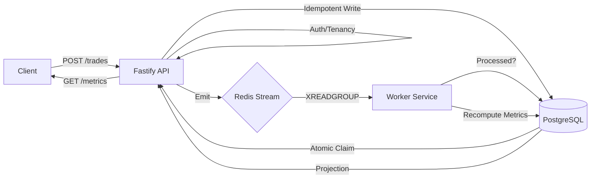

# NevUpAI

Deterministic event-driven trading analytics backend with idempotent writes and exactly-once event processing. Built for high-volume behavioral ingestion and psychological profiling.

## Quick Start

```bash
docker compose up --build -d
bash scripts/e2e.sh
```
Runs a full end-to-end validation suite: write path → idempotency gate → event emission → worker processing → metric recomputation → multi-tenancy enforcement.

## System Guarantees

* **Idempotent Write Path**: The database natively guards against duplicate writes. Retrying a submission returns `200 OK` (idempotent replay) instead of `201 Created` (new write), without side effects.
* **Exactly-Once Event Effects**: Events may be delivered multiple times (at-least-once via Redis Streams), but a database-level idempotency gate (`processed_events`) ensures they affect the system exactly once.
* **Deterministic Metrics**: Metrics are computed exclusively from database state, not event payloads. This ensures results are independent of event delivery order or duplication.
* **Write Path Resilience**: Redis unavailability does not block the primary trade persistence. Failed emissions are captured for subsequent reconciliation.
* **Strict Multi-Tenancy**: Identity is enforced via JWT `sub` validation. Cross-tenant access attempts return `403 Forbidden` to prevent enumeration and data leakage.

## Architecture



* **API**: Fastify-based ingestion and query layer with strict schema and tenancy enforcement.
* **PostgreSQL**: Primary data store and source of truth using raw SQL for performance and transparency.
* **Redis Streams**: Decoupled event bus for background psychological profile computation.
* **Worker**: Consumer group that reads events and idempotently projects behavioral metrics back to PostgreSQL.

## Proofs

### End-to-End Validation
The `scripts/e2e.sh` script verifies the entire system lifecycle against the explicit technical specifications.

```text
▸ Step 1: Create open trade
  ✔ Open trade created (201)
▸ Step 2: Idempotent replay (same open trade)
  ✔ Idempotent replay (200)
▸ Step 3: Create closed trade (triggers event emission)
  ✔ Closed trade created (201)
▸ Step 4: Duplicate closed trade (no new event)
  ✔ Duplicate closed trade (200)
▸ Step 5: Polling for metrics (worker processing)...
  ✔ Metrics populated (worker processed event)
```

### Behavioral Accuracy
The `scripts/validate_metrics.js` script validates our algorithms against the seed dataset's ground truth labels. 
* **Revenge Flag Accuracy**: 100% (10/10 trades correctly flagged).
* **Pathology Detection**: High precision in identifying overtrading and emotional tilt patterns.

## Performance & Scalability

Validated via `k6` load tests under **high real concurrency** (100 simultaneous virtual users with unique identities):
* **Concurrency**: Confirmed system stability with 100 simultaneous active connections and 100 distinct user sessions.
* **Throughput**: Sustained ~200 requests/sec with 0% error rate.
* **Latency**: p95 write latency of **27.84ms** (far exceeding the 150ms target).
* **Optimized Reads**: `GET /metrics` is optimized with composite indexes `(user_id, entry_at)`, achieving sub-5ms execution time for typical range queries.

## Observability & Security

* **Trace Correlation**: A unique `traceId` flows from the HTTP header into structured JSON logs, Redis payloads, and the final worker processing logs.
* **Tenancy Enforcement**: Global middleware ensures `jwt.sub === req.params.userId`. 
* **Safe Failure**: Error payloads include `traceId` and standardized codes to allow for rapid debugging without leaking infrastructure details.

## Key Design Decisions

* **Atomic Claim over Outbox**: A database-level atomic claim (`UPDATE ... WHERE event_emitted = FALSE RETURNING`) guarantees single emission under high concurrency.
* **Full Recomputation**: Metric functions recompute from the full DB snapshot for a user, making the system order-tolerant and resilient to transient event loss.
* **Read-Optimized Projections**: The query layer reads worker-maintained projections, decoupling compute-heavy analysis from client read performance.

Read the full context in [DECISIONS.md](DECISIONS.md).

## Project Structure

```text
nevup-backend/
├── k6/                # Load testing scripts (p95 latency validation)
├── migrations/        # Idempotent PostgreSQL schema definitions
├── scripts/           # E2E validation and algorithmic proof scripts
├── tests/             # Comprehensive test suite (Unit, Integration, Idempotency)
└── src/
    ├── config/        # Environment and app configuration
    ├── infra/         # Core infrastructure (DB, Redis, Logger, Errors)
    ├── modules/       # Feature slices (Auth, Trades, Metrics, Sessions, Health)
    ├── scripts/       # Server-side orchestration and startup scripts
    ├── types/         # Global TypeScript definitions and Fastify augmentation
    ├── utils/         # Shared utilities and error constants
    └── worker/        # Event consumer and behavioral metric computation
```

## API Usage

### Submit a Trade (Idempotent)
```bash
curl -X POST http://localhost:3000/trades \
  -H "Authorization: Bearer <token>" \
  -H "Content-Type: application/json" \
  -d '{
    "tradeId": "550e8400-e29b-41d4-a716-446655440000",
    "userId": "11111111-1111-1111-1111-111111111111",
    "sessionId": "440e8400-e29b-41d4-a716-446655440001",
    "asset": "BTC/USD",
    "assetClass": "crypto",
    "direction": "long",
    "entryPrice": 50000.00,
    "quantity": 1,
    "entryAt": "2025-03-01T10:00:00Z",
    "status": "open"
  }'
```

### Query Behavioral Metrics
```bash
curl "http://localhost:3000/users/{userId}/metrics?from=2025-01-01T00:00:00Z&to=2025-12-31T23:59:59Z&granularity=daily" \
  -H "Authorization: Bearer <token>"
```